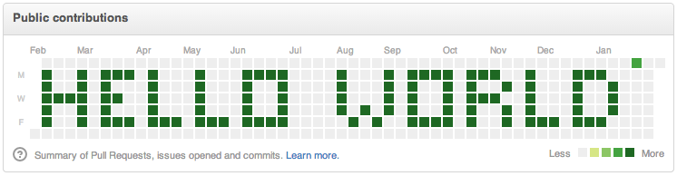

 
Hi, my Name is Matias Romero but friends call me Bati 👋😏

I’m currently working on the final project of Henry's bootcamp (+650 hours) 🙌

I want to learn *Python, Next.JS, Angular, React Native !* 👨‍🎓 

My hobbies are:
 - Listening 🎧 🎼  ;
 - Reading fiction books 👽 (we are not alone);
 - Playing ⚽️ 🏀;
 - Playing video games 🎮 👾;

<h3 align="left">Connect with me!</h3>

<a href="https://www.linkedin.com/in/batiromero-dev/" target="_blank"> - Linkedin profile</a>

<a href="mailto:mattmromero@gmail.com" target="_blank"> - mattmromero@gmail.com</a>

<a href="https://batiromero.netlify.app/" target="_blank"> Website & Portfolio</a>

<h3 align="center">Technologies I've learned & I'm learning:</h3>

<a href="https://developer.mozilla.org/en-US/docs/Web/JavaScript" target="_blank"> Javascript</a>
<a href="https://www.w3.org/html/" target="_blank">HTML5 </a>
<a href="https://www.w3schools.com/css/" target="_blank">CSS3 </a>
<a href="https://getbootstrap.com" target="_blank">Bootstrap </a>
<a href="https://reactjs.org/" target="_blank">React Js </a>
<a href="https://redux.js.org" target="_blank">Redux </a>
<a href="https://material-ui.com/" target="_blank">Material-Ui </a>
<a href="https://nodejs.org" target="_blank">Node Js </a>
<a href="https://expressjs.com" target="_blank">Express Js </a>
<a href="https://www.nginx.com" target="_blank">Nginx</a>
<a href="https://webpack.js.org" target="_blank">WebPack </a>
<a href="https://firebase.google.com/" target="_blank">Firebase </a> 
<a href="https://supabase.io/" target="_blank">Supabase </a> 
<a href="https://cloud.google.com" target="_blank">Google Cloud </a>
<a href="https://www.postgresql.org" target="_blank">Postgresql </a>
<a href="https://www.mysql.com/" target="_blank">Mysql </a>
<a href="https://www.sqlite.org/" target="_blank">Sqlite</a>
<a href="https://www.gnu.org/software/bash/" target="_blank">Bash </a>
<a href="https://mochajs.org" target="_blank">Mocha Js </a>
<a href="https://git-scm.com/" target="_blank">Git </a>
<a href="https://git-scm.com/" target="_blank">GitHub </a>
<a href="https://www.figma.com/" target="_blank">Figma </a>
<a href="https://heroku.com" target="_blank">Heroku </a>

<a href="https://postman.com" target="_blank">Postman</a>

